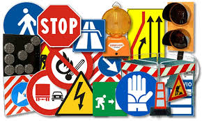
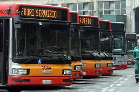
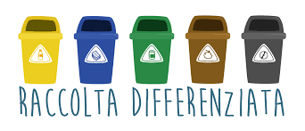

# Dati Open Civitas 
I dati Open Civitas appartengono al MEF e sono utiliazzati nell'omonimo progetto portato avanti da SOSE. 
SOSE è una Spa fondata da MEF e Banca d'Italia che, dal 1999, si occupa di analisi strategica di dati e di supporto metodologico all'Amministrazione finanziaria.

## Descrizione dei dati

Il range temporale coperto va dal 2010 al 2013, pertanto la serie storica non è eccessivamente lunga e soprattutto, è poco "attuale".

I dati hanno due diverse granularità: *comunale* (2010-2013) e *provinciale* (2010) e si possono immediatamente suddividere in due filoni:

- *Fabbisogni*: quantità di risorse necessarie al fine dello svolgimento di attività e servizi finalizzati al perseguimento di fini pubblici.

-  *Spesa*: denaro utilizzato per adempiere ai serivi pubblici.

Per quanto riguarda i fabbisogni, abbiamo, per ogni area di interesse, degli indicatori che dettagliano lo specifico fabbisogno secondo le sue caratteristiche e prestazioni. La spesa è meno dettagliata in quanto offre l'importo speso per il singolo fabbisogno.

### Aree

- Entrate tributarie e servizi fiscali
- Uffici tecnici
- Anagrafe, Stato civile, elettorale
- Servizi generali
- Polizia locale
- Istruzione pubblica
- Viabilità
- Trasporto pubblico e locale
- Gestione del territorio
- Gestione territorio ed ambiente (rifiuti pubblici) 

## Proposte

Nonostante tutte le aree sopraelencate risultino essere estremamente interessanti, con l'intenzioni si evidenziare le potenzialità di DAF, incrociando dati provenienti da diverse PA o enti che raccolgono dati pubblici, penso possa essere interessante concentrarsi su questi tre filoni:

1. Istruzione pubblica
2. Viabilità e trasporto pubblico
3. Gestione territorio ed ambiente (focus rifiuti) 

### 1) Istruzione 

Per il settore istruzione mi muoverei così:

* __Step 1__: analisi di statistica descrittiva sugli indicatori relativi a usufruizione del servizio di refezione, servizio di trasporto, centri estivi, studenti che frequentano la scuola comunale, spesa storica della funzione istruzione per abitante, capacità del Comune di soddisfare la domanda di servizi espressa dai cittadini.
* __Step 2__: *Ridefinire l'Italia secondo i fabbisogni dei comuni*: clustering dei comuni, analisi dei cluster: corrispondono ad una suddivisione territoriale? Oppure, i gruppi si distinguono per altre caratteristiche (i.e. popolazione, dimensione area urbana). Attenzione particolare per il livello di soddisfazione media dei diversi cluster. Terrei fuori dalle variabili di cluster la spesa pro-capite, così da vedere se comuni con simili fabbisogni registrano spese simili o no. 
* __Step 3__: spesa pro capite vs soddisfazione dei cittadini. Sulla base delle, brevi, serie storiche che abbiamo, possiamo dire che l'aumento/riduzione della spesa influiscono sulla percezione dei cittadini? In altre parole, per provvedere ai bisogni dei cittadini è necessario spendere tanto o si uò fare bene con meno?

Per effettuare queste analisi dovrebbero bastare i dati di OpenCivitas. Per indagini dettagliate sui cluster, potrebbero essere utili i dati contenuti in:

* `anagrafica_comuni`: andamento della popolazione dal 1971 al 2017 (decennale-quinquennale)
* `info_comuni`: regione, superficie, latitudine, longitudine, etc (maggiori informazioni sul rispettivo `README.md`)
* Nella cartella, scaricata da ISTAT, `Archivio elenco comuni codici e denominazioni_Anni 2008_2013`, si trovano le informazioni relative ai comuni per i diversi anni, se necessario c'è anche quella dal 2014 al 2017.

### 2) Viabilità e trasporto pubblico

#### Viabilità

Per quanto riguarda la viabilità mi concentrerei sulla granularità provinciale in quanto risulta più semplice trovare dati da incrociare a questo livello. Dal momento che le informazioni a livello provinciale sono ristrette all'anno 2010, procederei con l'aggregazione dei dati comunali. Quindi, definendo anche in questo caso, dei possibili step di analisi:

* __Step 1__: analisi di statistica descrittiva di variabili come Spesa storica del servizio viabilita' per abitante, Spese del servizio viabilita' per km di rete stradale, Incidenti rilevati per 100 km di rete stradale, Km lineari di piste ciclabili, Mq aree pedonali.
* __Step 2__: Focus su incidenti stradali, nelle province, legati alla viabilità della provincia. In particolare, si può porre l'attenzione su incidenti stradali con lesioni alle persone sviluppando studi descrittivi sull'intersezione ove l'incidente è avvenuto (dosso, rotatoria etc) che potrebbero essere identificate come proxy della manutenzione e segnalazione stradale.
* __Step 3__: quanto influisce la presenza di piste ciclabili ed aree pedonali sul grado di soddisfazione dei cittadini?

Per effettuare le analisi si utilizza OpenCivitas su viabilità comuni, che vengono aggregati per provincia (si può usare  `Archivio elenco comuni codici e denominazioni_Anni 2008_2013` per aggregare i dati). I dati sugli incidenti nelle province li troviamo sul sito dell'[ISTAT] (http://dati.istat.it/Index.aspx?DataSetCode=DCIS_MORTIFERITISTR1#). Per ottenere i dati cui siamo interessati dobbiamo variare dei parametri. Inoltre, sul sito dell'ACI, sono presenti delle tabelle che riassumono dati simili. Per ottenerli si può accedere al seguente URL `http://www.aci.it/laci/studi-e-ricerche/dati-e-statistiche/incidentalita/la-statistica-istat-aci/ANNO.html`, dove `ANNO` corrisponde all'anno cui siete interessati tra il 2006 ed il 2015. 

#### Trasporto pubblico

Anche per il trasporto pubblico è conveniente fare le analisi su base provinciale. Si potrebbe procedere come segue:

* __Step 1__: analisi di statistica descrittiva di variabili come Passeggeri per Km ogni 1.000 abitanti, Velocita' commerciale, Fermate per km di rete stradale dei mezzi, etc. 
* __Step 2__: quanto sono soddisfatti i bisogni dei cittadini? Qual è la spesa e la caratteristica dei comuni con più alta soddisfazione? A grandi città corrisponde un calo di soddisfazione? L'insoddisfazione/soddisfazione dei cittadini si riflette sull'utilizzo di mezzi di trasporto propri o pubblici per recarsi al luogo di lavoro/a scuola? Purtroppo per incrociare i dati è necessario fare qualche analisi a livello regionale.
* __Step 3__: la spesa sui trasporti pubblici si riflette sulla soddisfazione dei cittadini?

Per queste analisi si fa riferimento ai dati Open Civitas. Per l'incrocio con altri dati interessanti si fa riferimento ai dati sul trasporto messi a disposizione da ISTAT:

* `data/trasporto/tavole-statistiche.xlsx`: domanda ed offerta di trasporto pubblico locale 2011-2015.
* `data/trasporto/MOBILITA' URBANA_2014.xls`: mobilità urbana 2008-2014.
* Sito [ISTAT](http://dati.istat.it/#) > Servizi > Trasporto aereo, etc > Spostamenti abituali per andare a scuola

### 3) Gestione territorio ed ambiente

Relitavamente a tale settore, si pone il focus sui rifiuti.

* __Step 1__: analisi descrittiva dei dati comunali di Open Civitas. Quindi, analisi e studio correlazioni di variabili come: Spesa del servizio rifiuti per tonnellata di rifiuti raccolti, Tonnellate di rifiuti raccolti e trasportati per abitante, Rifiuti da raccolta differenziata sul totale rifiuti.
* __Step 2__: con riferimento ai dati del catasto dei rifiuti (font ISPRA) cerchiamo di vedere la possibile presenza di correlazione tra spesa procapite e produzione di rifiuti di diverso genere (vertro, plastica etc). Ci sono rifiuti che gravano maggiormente sulla spesa? 
* __Step 3__: Cluster dei comuni per studiare il grado di soddisfazione dei comuni con fabbisogni simili, soddisfazione elevata corrisponde alla presenza di servizi relativi alla raccolta differenziata? 

A tal proposito usiamo i dati Open Civitas incrociati con i dati ISPRA:
* `data/rifiuti/catasto_rifiuti_dati_di_dettaglio_da_2010_a_2013.csv`: informazioni al dettagli dei rifiuti prodotti dai comuni.

